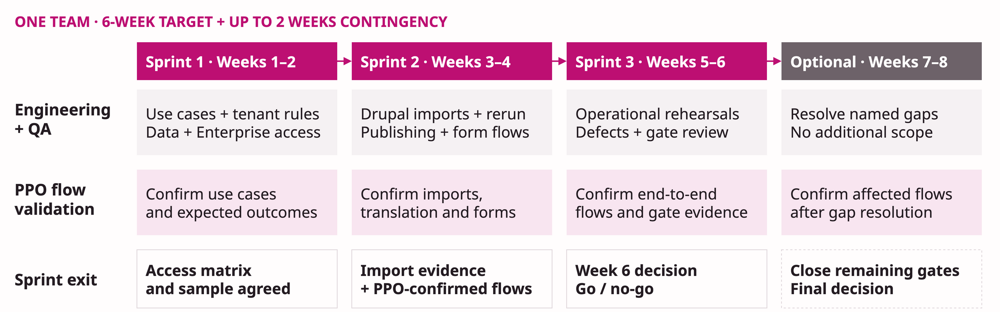
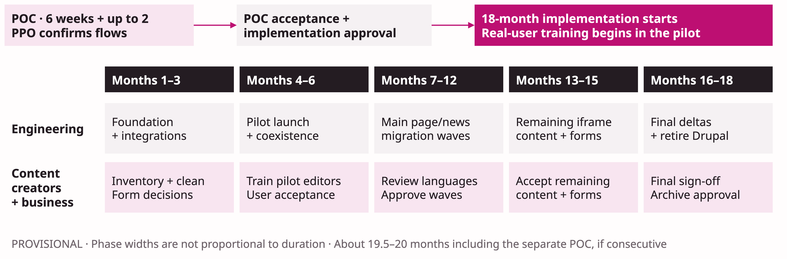

# Payload POC and Drupal replacement delivery plan

**Management proposal · updated 6 September 2026**

Allocate one team to a **six-week Payload POC**, with a go / no-go review at the end of week 6. Allow **up to two additional weeks** only for named unresolved validation or vendor dependencies. Close the POC when its gates are met. The provisional **18-month implementation target starts after POC acceptance and implementation approval**.

This is the detailed delivery, budget and success-measure authority for the [management deck](../../apps/slides/slides.md) and [platform proposal](./demo-plan.md). The existing demo and vendor comparison inform the POC; they do not replace tests against the actual estate.

## POC scope

The existing demo establishes familiarity with Payload's code-first model, structured content, localization, permissions, forms and Next.js integration. Self-hosting on GCP/GKE is an understood architecture choice; production capacity and recovery still need validation. Reuse that foundation for the actual tenant model, Drupal import and Enterprise flows.

Payload provides official Form Builder and Multi-Tenant plugins. Those are useful foundations, not proof that every existing business form or country/global access rule already fits. Its plugin system supports reusable extensions to configuration, collections, hooks and Admin functionality. Environment promotion and migration controls can use that extension model. See the official [plugin overview](https://payloadcms.com/docs/plugins/overview), [building plugins](https://payloadcms.com/docs/plugins/build-your-own) and [advanced plugin API](https://payloadcms.com/docs/plugins/plugin-api).

TypeScript, PostgreSQL, Next.js and the project's Tailwind UI provide a familiar stack for AI-assisted engineering. AI Agents can help draft import mappings, implementation, tests and documentation. Human review and QA remain mandatory; the schedule assumes no unmeasured speed multiplier.

| POC workstream                                               | Evidence to produce                                                                                                                                                                                      |
| ------------------------------------------------------------ | -------------------------------------------------------------------------------------------------------------------------------------------------------------------------------------------------------- |
| Does the actual multi-tenant model fit?                      | Global + two representative country scopes, shared/global content rules, multi-country roles, tenant-owned media, independent language permissions and denied-access tests through Admin and public APIs |
| Can Drupal content move reliably?                            | Repeatable import of news and iframe-backed pages with their media; preserve required languages, URLs/redirects, dates, taxonomy and relationships; demonstrate deltas and reconciliation                |
| Environment promotion exploration (not an acceptance metric) | Git/schema migration plus a ONE-built reference/content promotion prototype with previewable diff, stable IDs, relationship/media mapping, approval, audit, conflict detection, retry and rollback       |
| Do Enterprise workflows fit editors?                         | Vendor-enabled publishing and translation tasks: review, rejection, rework, scheduling, locale-specific readiness, audit and permissions; compare with the demo's custom workflow                        |
| Does Enterprise AI add usable value?                         | Available translation/writing tools with human review, brand terminology, access controls and usage visibility; record exact release, entitlement and provider conditions                                |
| Can the platform operate safely?                             | One representative form end to end; SSO/access validation; GKE integration, representative load, publishing/cache/search behavior, restore, upgrade and route rollback rehearsals                        |

The [Enterprise AI page](https://payloadcms.com/enterprise/enterprise-ai), checked 6 September 2026, marks image generation and writing assistance “Coming Soon”. Confirm available tools in the technical vendor meeting; keep roadmap tools outside required POC evidence unless business explicitly requires them. Validate [Publishing Workflows](https://payloadcms.com/enterprise/publishing-workflows) using the licensed product; a custom approximation does not prove the Enterprise feature.

**Scope boundary:** Prove representative paths, not all 27 site migrations. Prioritize use-case, Drupal import, safety and OTS evidence. Environment promotion is exploratory and must not delay gate completion. Broad RAG, full experimentation rollout, all form variants and optional custom AI providers are stretch scope after the mandatory gates. Record an unavailable required capability as an unresolved gap, with an owner and decision; do not silently replace it or mark it passed.

## Team, dependencies and working model

Two teams are available; each has **6 developers, 2 QA, 1 PPO and 1 TA (Technical Architect / tech lead)**. Total: 12 developers, 4 QA, 2 PPOs and 2 TAs, or 20 people. **PO sits outside these teams and provides higher-level product direction, prioritization and approvals. PPO owns the team backlog, day-to-day acceptance and flow confirmation.**

- **Team A owns the POC:** six developers pair across tenancy/workflows, Drupal imports, and platform/integration. Two QA establish test data and continuously validate acceptance. PPO owns the team backlog and day-to-day acceptance; TA owns architecture, technical evidence and vendor questions.
- **Team B continues existing delivery during the POC.** After the gate, propose Team A for platform/operations and Team B for website integration/migration, subject to portfolio allocation.
- **PPO validates POC flows:** the PPO helps check and confirm representative publishing, translation, AI and form scenarios with TA and QA. The POC has no real-user training, onboarding or end-user usability trials. Content-creator training, user acceptance and adoption measurements begin during implementation. PPO is part of each team, not an additional support role.
- Platform/security specialists and procurement provide shared support. AI Agents assist implementation and documentation; developers review changes, QA verifies behavior, and PPO confirms the POC flows. Business content owners approve production content during implementation.

**Before week 1:** obtain representative Drupal extracts and assets, document required countries/languages and roles, enable GCP sandbox access, secure Enterprise evaluation access, book vendor sessions, and confirm PPO availability. The six-week clock starts once these inputs and Team A's capacity are available. Delayed vendor access or data changes the forecast.

## Detailed POC timeline: six-week target and contingency

[Editable POC timeline](./diagrams/poc-timeline.drawio)

| Sprint                                            | Delivery work                                                                                                                             | PPO validation                                                        | Exit evidence and owner                                                           |
| ------------------------------------------------- | ----------------------------------------------------------------------------------------------------------------------------------------- | --------------------------------------------------------------------- | --------------------------------------------------------------------------------- |
| **1 · Weeks 1–2: scope and foundations**          | Confirm tenant rules and use cases; profile Drupal samples; verify GCP and Enterprise access; establish QA baseline                       | Confirm representative data, access policy and expected flow outcomes | TA + QA: access and test baseline. PPO: agreed use cases and sample               |
| **2 · Weeks 3–4: imports and flows**              | Import news/iframe pages and media; verify repeatability; exercise publishing/translation and a representative form                       | Confirm imported examples and publishing, translation and form flows  | Developers + QA: import evidence. PPO: flow confirmation. TA: Enterprise findings |
| **3 · Weeks 5–6: operational proof and decision** | Complete restore, load, upgrade and cutover rehearsals; close critical/high defects; document CMS costs and remaining implementation work | Confirm end-to-end flows and review the gate evidence                 | PPO + TA + QA: signed evidence; management go / no-go at end of week 6            |
| **Optional · Weeks 7–8: contingency**             | Address named unresolved validation or vendor gaps only; repeat affected checks                                                           | Confirm resolution of affected flows                                  | Close the outstanding gates and issue the final decision; no additional scope     |

Each sprint ends with a demonstration and evidence review. Close the POC when its gates are met. At the week-6 review, use contingency only for named gaps with an owner and completion date; it is not an automatic fourth sprint or an opportunity to expand scope. A fundamental blocker triggers a no-go or a platform decision review. Track unresolved items with owner, severity and due date. A required Enterprise feature without trial evidence prevents an unconditional pass; management can explicitly approve a bounded extension or scope change, or reopen the platform decision using the Directus comparison.

### Sample and environment-sync boundaries

Proposed minimum sample, finalized in sprint 1: **100 content records** across the global site and two representative countries, comprising 90 news items and 10 iframe-backed pages, including complex examples. Ordinary local/global pages are outside the POC migration sample; they remain in the full implementation scope. Include at least two languages, shared media, relationships, archived content and redirect cases. Add one form with its downstream submission journey. Expand the sample if these sites omit an important tenant or workflow pattern.

Environment synchronization is separate exploratory work and is not part of the defined POC migration acceptance metric. Migration acceptance covers only news and iframe pages, including their required media and relationships. Promote application/schema changes through Git and migrations. If capacity permits, explore a prototype for approved reference data and selected content with dry-run diffs and explicit conflict resolution. Record the remaining implementation work rather than treating promotion completeness as a POC gate. Never copy secrets or personal form submissions into lower environments; never overwrite newer production edits silently. Full database cloning and two-way editorial synchronization are outside this POC.

### POC decision gates

Use qualitative evidence to decide whether implementation should proceed. There are no percentage or timing sub-targets in the POC gates. Keep the required zero critical/high defect condition and comply with the established OTS SLA. Migration evidence covers news and iframe pages only; environment sync remains outside these gates.

| Gate                           | Evidence required                                                                                                                                         |
| ------------------------------ | --------------------------------------------------------------------------------------------------------------------------------------------------------- |
| Use-case coverage              | Payload covers ONE’s agreed tenant, publishing, translation and form use cases; PPO confirms the representative flows                                     |
| Drupal import                  | Demonstrate the ability to import news and iframe pages from Drupal with required media and relationships; review the imported results and repeatability  |
| Safe operation                 | Validate tenant access, approval controls and protection of unpublished content                                                                           |
| Operations and recovery        | Meet the OTS SLA                                                                                                                                          |
| Quality and decision readiness | Zero open critical/high defects; PPO, TA and QA sign-off; Enterprise scope and CMS costs documented, with unresolved commercial inputs clearly identified |

Record use-case and Enterprise gaps for a decision before implementation; unavailable evidence is not a passed gate. PPO flow confirmation demonstrates functional fit, not real-user adoption or time savings. Training and productivity measurement begin during implementation. The CMS budget includes infrastructure and Enterprise licence; AI costs are calculated separately.

## Overall roadmap: 18 months after the POC

**Provisional planning target only.** Run the six-week POC first, using contingency only for unresolved gaps, then make the implementation decision. **Implementation month 1 starts after POC acceptance and implementation approval**. The full sequence is about 19.5–20 months from POC kickoff if implementation follows immediately; approval/procurement gaps can extend elapsed time. The 18-month window covers development, content migration, real-user training and business acceptance.

[Editable implementation timeline](./diagrams/implementation-timeline.drawio)

| Period                                        | Engineering focus                                                                                    | Content creators / business focus                                                                       | Milestone                                       |
| --------------------------------------------- | ---------------------------------------------------------------------------------------------------- | ------------------------------------------------------------------------------------------------------- | ----------------------------------------------- |
| **Separate POC · 6 weeks + optional 2 weeks** | Team A executes three planned sprints, with optional contingency; Team B continues existing delivery | PPO confirms flows; no real-user training or trials                                                     | Go / no-go before implementation month 1        |
| **Implementation months 1–3**                 | Platform foundation, integrations, migration tooling and production operations                       | Full inventory across 26 countries + global; cleanup; form decisions; name wave owners                  | Foundation and inventory ready                  |
| **Months 4–6**                                | Pilot release, first imports, cutover/recovery rehearsal and controlled coexistence                  | Begin real-user training and user acceptance; establish Drupal task baselines; accept pilot content     | Pilot accepted                                  |
| **Months 7–12**                               | Scale country/global page and news waves; import iframe content and deliver forms                    | Create new content in ready Payload destinations; review language variants, redirects and form journeys | Main migration waves accepted                   |
| **Months 13–15**                              | Complete remaining migrations/integrations; resolve complex exceptions                               | Accept remaining inventory and forms; complete rollout training                                         | All migration groups ready for final acceptance |
| **Months 16–18**                              | Final deltas, dependency removal, stabilization, archive and Drupal shutdown                         | Sign off retained records, final content and retirement                                                 | Drupal retired by implementation month 18       |

Both teams' post-POC allocation is a proposal. Content creators participate during implementation with named ownership and agreed review capacity. Rebaseline after the POC using volumes, integration complexity, team allocation and content-review throughput. Track acceptance monthly; delayed review, form decisions or contract notice periods move retirement.

### Migration coverage and coexistence policy

| Content group                  | Required destination / acceptance                                                                                                                                                                                            |
| ------------------------------ | ---------------------------------------------------------------------------------------------------------------------------------------------------------------------------------------------------------------------------- |
| **All local and global pages** | Migrate content, required language variants, media and approved layouts. Country/global owners accept presentation, links, SEO and redirects                                                                                 |
| **All news**                   | Import from Drupal with dates, authors where required, media and relationships. Reconcile deltas before transferring edit ownership                                                                                          |
| **Drupal iframe pages**        | Import the underlying content/assets and implement required behavior in the new platform. Copying an iframe URL that still needs Drupal is not a completed migration                                                         |
| **Forms**                      | Business chooses migrate, rebuild or centralize for each form. Record destination and owner; test submissions, consent, notifications, integrations and retention. Decide separately how historical submissions are retained |

Run the platforms side by side while migration proceeds. Direct new content to Payload as each destination becomes ready. Any temporary exception needs a named owner and a dated migration task. Existing Drupal-owned items can continue changing until their wave freezes; import final deltas before cutover. Each route/item has exactly one authoritative CMS; avoid editing the same item in both systems.

Each wave has a content owner, acceptance checklist, reconciled ledger, redirects and rollback plan. Keep rollback available during validation; account for edits made after cutover. Retire the wave's Drupal read/sync path once accepted.

**Drupal shutdown gate:** 100% of the agreed inventory is migrated and accepted (or formally retired with business approval), all forms have an accepted destination, no live routes/iframes/integrations depend on Drupal, archives meet retention requirements, redirects and recovery are tested, and business/operations sign off after at least four stable weeks. Confirm Acquia/Drupal contract notice periods early enough to meet implementation month 18.

## Infrastructure and Enterprise budget comparison

**USD, monthly recurring incremental infrastructure plus Payload Enterprise licence (TBC); rough planning allowances, not a quote.** Reuse the current app's GKE cluster and Cloudflare project. Add a Cloud SQL PostgreSQL instance and dedicated GCS bucket. No development, QA, migration labor or content-creation costs are included.

| Cost item                                | Current Drupal / Acquia                          | New CMS incremental allowance                                                                            |
| ---------------------------------------- | ------------------------------------------------ | -------------------------------------------------------------------------------------------------------- |
| Hosting / compute                        | **TBC — detailed breakdown expected Monday**     | **$0–200/month** extra capacity in existing GKE cluster                                                  |
| Database                                 | TBD — split from hosting if bundled              | **$300–500/month** Cloud SQL PostgreSQL Enterprise edition, regional HA, 2 vCPU / 8 GiB RAM, 100 GiB SSD |
| Asset storage / operations               | TBD                                              | **$5–20/month** new regional Standard GCS bucket, assumed 100 GiB assets                                 |
| Edge / network / logs / backups          | TBD — include any separate CDN or transfer bills | **$50–150/month** usage allowance; retain existing Cloudflare project/plan                               |
| DEV / STAGE                              | TBD — distinguish included environments          | **$100–250/month** shared non-production allowance                                                       |
| **Infrastructure subtotal**              | **Pending Monday input**                         | **$455–1,120/month; rounded planning envelope $500–1,150/month**                                         |
| **Annualized infrastructure envelope**   | **Pending**                                      | **$6,000–13,800/year**                                                                                   |
| **Payload Enterprise licence / support** | Existing licence/support scope to separate       | **TBC — request written quote from Payload sales**                                                       |
| **Recurring CMS budget (excluding AI)**  | **Pending Monday breakdown**                     | **Infrastructure + Enterprise licence (TBC); AI costs excluded**                                         |

Sizing assumptions: provisional Singapore region, 730 running hours/month, on-demand rates with no committed-use discounts, USD before tax. The requested 100 GB database case is approximated by 100 GiB provisioned SSD; it is not the current measured data size. Database size alone does not establish compute capacity. The Cloud SQL line covers HA compute and SSD; retained backup usage is in the usage allowance. Non-production assumes shared DEV/STAGE capacity and a small non-HA database, not production parity.

The GCS assumption is separate from database size. Media retention/versioning, operations and network traffic can dominate a small storage bill. Confirm bucket volume, backup retention and Cloudflare delivery during the POC. Existing GKE/Cloudflare base charges stay with the current app, but extra nodes, egress or plan limits can increase the incremental amount. Confirm existing search and observability capacity; if new dedicated capacity is needed, revise the allowance.

These ranges are engineering planning allowances informed by the official [Cloud SQL pricing model](https://cloud.google.com/sql/pricing), [Cloud SQL product pricing overview](https://cloud.google.com/sql) and [Cloud Storage pricing](https://cloud.google.com/storage/pricing), checked 6 September 2026. They are not a region-specific calculator export. Platform owners must replace them with a configured regional quote and measured capacity after the POC. For a temporary non-HA POC database, allow roughly $150–250/month for that database only; do not use that figure as the production HA budget.

**Cost objective:** The new CMS should reduce recurring platform cost and maintenance effort compared with the actual 27 Drupal instances. Consolidation replaces repeated patching, releases, regression work and incident coordination with one shared platform. This is the expected business outcome; the amount and percentage of savings require Monday’s baseline and the Enterprise quote.

**Commercial inputs:** Payload Enterprise licence/support appears explicitly as TBC in the budget, outside the infrastructure subtotal. AI costs are excluded from this CMS budget. The platform leaves room for AI integration through plugins and MCP; calculate integration, optional AI add-ons and provider usage separately against agreed use cases and volumes. Ask the vendor to separate optional AI charges from the Enterprise CMS quote. Confirm the CMS licence before procurement; do not present infrastructure alone as the full CMS budget. Development costs remain excluded.

**During coexistence:** monthly infrastructure spend = retained Drupal infrastructure + new CMS increment + any exceptional migration transfer/storage charges. Savings start only when corresponding Drupal services/contracts actually retire. Monday's cost breakdown should separate infrastructure from bundled support/licensing and use the same environment and currency basis; do not compare the full Acquia contract against only incremental GCP storage.

## Technical service measures

These are production service measures, not additional numerical POC gates. During implementation, agree a representative workload using current traffic, concurrent editors, tenant/language mix and content volume. Use POC rehearsals to identify operational gaps, not to claim long-term service performance.

| Area                    | Target or review criterion                                                             | Measurement                                                                                                                      |
| ----------------------- | -------------------------------------------------------------------------------------- | -------------------------------------------------------------------------------------------------------------------------------- |
| Availability            | At least 99% annual availability for CMS and public delivery                           | Monitor services separately and include planned downtime                                                                         |
| Security                | No open critical/high findings; tenant, role and unpublished-content controls verified | Security scans and access tests before release; periodic access reviews                                                          |
| Speed                   | Public delivery and editor actions perform at least as well as the agreed baseline     | Record response-time percentiles and request errors under representative load; distinguish cached reads and asynchronous AI jobs |
| Content freshness       | Approved content appears correctly on the site and in search                           | Measure publish-to-visible delay and investigate failed updates                                                                  |
| Operations and recovery | Meet the OTS SLA: recovery within 4.5 hours                                            | Confirm SLA compliance                                                                                                           |

Set detailed response-time and freshness targets during implementation against actual traffic and platform capacity. Review production monitoring after launch; short POC rehearsals do not establish an annual availability record.

## New CMS platform success measures

Keep full Drupal migration as the required outcome. Use modest initial improvement targets, confirmed against the Drupal baseline during implementation, and review results after each rollout wave.

| Measure               | Proposed target                                                                                                                                                  |
| --------------------- | ---------------------------------------------------------------------------------------------------------------------------------------------------------------- |
| Drupal retirement     | 100% of agreed Drupal content migrated and accepted across all 27 site scopes; no Drupal dependencies by implementation month 18, subject to the retirement gate |
| Editor readiness      | At least 80% of active editors trained and able to complete core publishing tasks                                                                                |
| Publishing efficiency | Aim for 10% less publishing and reviewed translation time without reducing content quality                                                                       |
| Service reliability   | At least 99% annual CMS availability; operations and recovery meet the OTS SLA                                                                                   |
| Cost and maintenance  | Lower CMS running cost and maintenance effort than the current Drupal estate                                                                                     |

Measure editor readiness as the share of active editors who are both trained and able to complete the agreed tasks. Compare median publishing and reviewed translation times against similar Drupal content/language cohorts, including review and correction. Compare actual recurring CMS costs and maintenance effort after retirement; exclude AI and development costs from this CMS budget. No improvement is claimed before measurement.

At the POC decision, management receives signed gate evidence, open vendor/commercial conditions, documented CMS costs and the implementation backlog. Unresolved critical/high defects or use-case gaps require a decision before proceeding.

## Meeting with Payload sales after approval

After management approves the direction, the TA and PPO will request a technical discovery meeting with Payload sales and a solutions engineer, supported by procurement. No meeting or purchase is assumed to have happened. The agenda covers:

- **Enterprise feature depth:** demonstrate publishing and translation workflows, available AI, SSO and audit; confirm release availability, self-hosted support, extension points and evaluation access.
- **ONE’s technical questions:** actual global/country tenancy and shared content, permission boundaries, Drupal import/deltas, environment promotion, GKE/Cloud SQL operation, upgrade compatibility, recovery/performance and AI data handling. TA maintains the question log; PPO contributes flow questions.
- Written licence/support pricing for 27 site scopes, production and non-production, including seat/tenant limits, support/SLA, renewal and exit terms, with any optional AI add-on or provider/usage charges itemized separately and excluded from the CMS budget.
- Confirmed release availability and roadmap dependencies, trial dates and technical support during the six-week POC and optional contingency.

Bring the current 27-instance Drupal model, the POC acceptance scenarios and Monday’s cost breakdown. The output is a written answer/action log with owners, confirmed Enterprise scope and technical constraints, a trial plan, a licence quote (or quote due date), and an updated recurring-cost comparison. Schedule the six-week POC once access and other entry criteria are ready; the 18-month implementation target starts after the POC and implementation approval.
